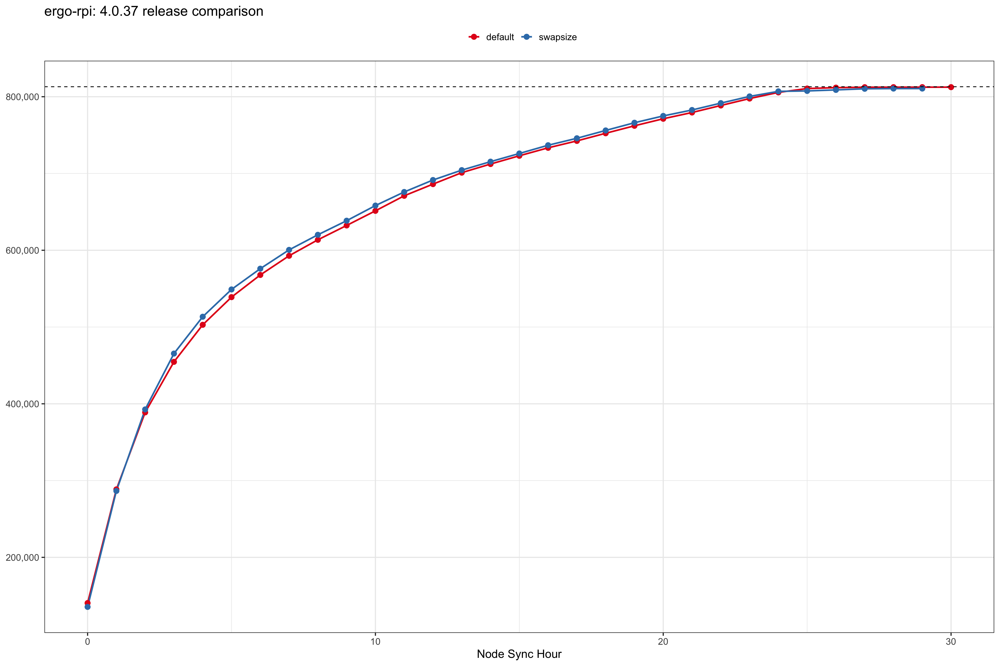

## Node Runner

The Ergo node completes a full sync in 3 separate stages: `headers`, `node`, and `wallet`.

Since the `node` sync phase is the most time consuming part of the process, the goal of this is to track and compare node sync durations over time. With this data we can benchmark each version, estimate time to sync for an RPi, identify optimal configurations, shed light on issues, and more. 

## Release: 4.0.37

Full `node` sync for this version completed in 26 hours with default settings which is a significant improvement to v4.0.35 of 46 hours (-43% reduction).



| Config | Start Date | Start Time | Start Height | Start GB | End Date | End Time | End Height | End GB | 
| --- | --- | --- | --- | --- | --- | --- | --- | --- | 
| default | 2022-08-08 | 13:04:06 | 811429 | 2.1 | - | - | - | - | 
| swapsize | 2022-08-08 | 13:04:06 | 811249 | 3.9 | - | - | - | - | 

## DIY analysis

### Retrieve & process log files

```bash
bash runner-logs.sh 
```

Enter your `node IP address` and `node logs directory` when prompteed.

### Compute results

You'll need the [R](https://www.r-project.org/) statistical computing language and a few packages: `tidyverse`, `lubridate`, `scales`.

```r
Rscript logs-comparo.R 
```

### Appendix

#### Deprecated 

| Release | MicroSD | SWAP config | Crashes | Headers | Node | Wallet | Total | 
| --- | --- | --- | --- | --- | --- | --- | --- | 
| 4.0.35 | 256gb | yes | - | 2h | [in progress] | - | - | 
| 4.0.35 | 256gb | - | 2 | 2.25h | 46h | 13h | 2.6 days | 
| 4.0.27 | 256gb | yes | - | 1h | 30h | 5h | 1.5 days | 
| 4.0.27 | 32gb | yes | 4 | 3h | 90h | 15h | 4.5 days | 


